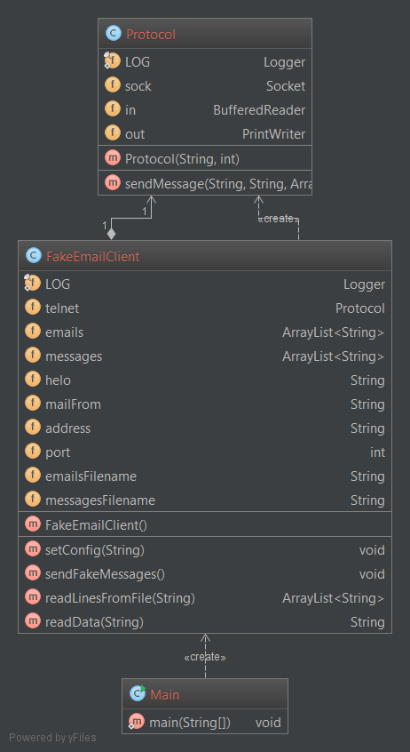

# Fake Mail sender #

**Author**: Samuel Darcey Aka "Le Poulet Suisse"

## Summary ##
This application will send emails build up with random messages to random people (Specify in a file) separated by groups (Set up when the application start). You will enjoy prank your friends with this application!  
It open a socket with a Mock server (Local Webmail server) and send data through it with the telnet protocol.
## Requirements ##
This application need the following things:  
1. A mock server that is running on your machine (More explanation belove)  
2. Java 7 or higher (C.F. [Java](https://www.java.com/ "Java"))  
## Installing/Setup the Mock server ##
The easiest way to install and run MockMock is by downloading the jar file [here](https://github.com/tweakers-dev/MockMock/blob/master/release/MockMock.jar?raw=true "here").Start the server by running: **java -jar MockMock.jar**.  
This will start the Mock server with the default configuration (Web interface on port 8282 and SMTP server on port 25).  
To acces to the web interface, simply open your favorite browser and use the following address: [http://localhost:8282/](http://localhost:8282/)  
  
For more information about the Mock server, see [here](https://github.com/tweakers-dev/MockMock)
## Using the application ##
For using this application, you will need to do a few things.   
1. Open the config.txt file.  
2. Specify the Helo message to send to the server.  
3. Specify the Mail from message to send to the server.  
4. Specify a file that contains all the email addresses you want to prank.  
5. Specify a file that will contains links to single file that contains messages for the prank.  
6. Specify the address and the port of the Mock server. (localhost and port 25 by default)  
7. Finally, build the application and execute the Main class. (Either in command line or with your java editor)  
8. In the application, it will ask you do determine the number of groups you want. Be sure to specify a number that allow you to have 1 sender and 2 receiver in each groups!  
9. **Enjoy the prank!**  
  
**N.B.** A config.txt file is available in the directory of the application with a list of emails and a list of messages. Simply read it and you will understand fast how it works! Have a look in a exemple of message, you have to write ALL the data send to server (With the Subject and the empty line!)

## Detailed description ##
This application work with a very simple architecture of client-protocol. I choose this implementation and not the fact to make Object with everything because the email addresses and the messages are not reused after the messages are sent. This means that use object will only increase the memory used. In fact, this is possible to change the programm to allow it for any purpose of used for SMTP communication (And not only for fake messages) but i didn't start the application with this view.  
  
All errors in the execution of the application (Bad input, bad response, etc...) result to raise a RuntimeException with a appropriate message about the error that occured.
  
You can see a diagram of the application belove.  

### Main ###
The only purpose of the Main is to start the client and ask for sending a bunch of fake messages.  
### Protocol ###
The protocol is a simple class that allow you to send a message to a address and a port specified in the constructor through the SMTP protocol. This class can be used for any SMTP telnet communication.  
Every response from the server are checked. If a bad response code is coming, it raise a RuntimeException.
### FakeEmailClient ###
The client is the core of the application. When you call the constructor, it will first load the configuration file and set the variable in the application. Then, it will create a new Protocol with the address and port. Finally, it will load the emails and links to messages in memory and shuffle the arrays for a pseudo random generation. Note that will only load the links to messages and not the content of messages for not overflowing the memory if you are a good writer ;)  
  
When you call the *sendFakeMessages()* method, it will ask you for the number of groups you want to form, create this groups one by one with the given email addresses and attribute one message to each group and finally send the mails using the *sendMessage(...)* method from the Protocol.

